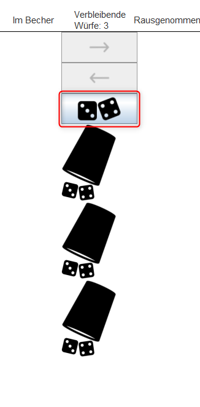
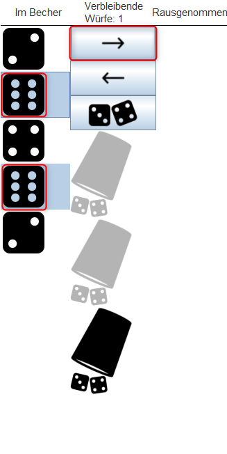
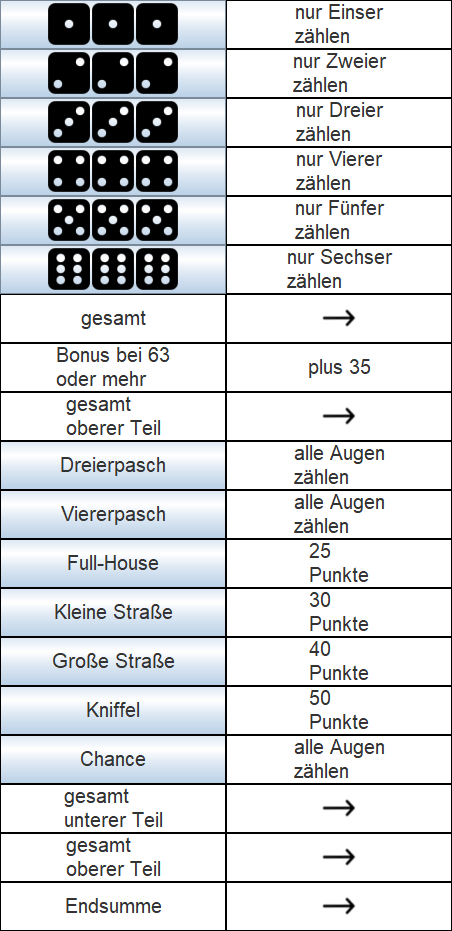
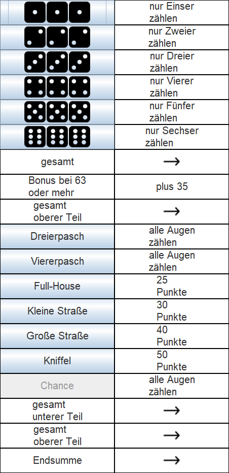
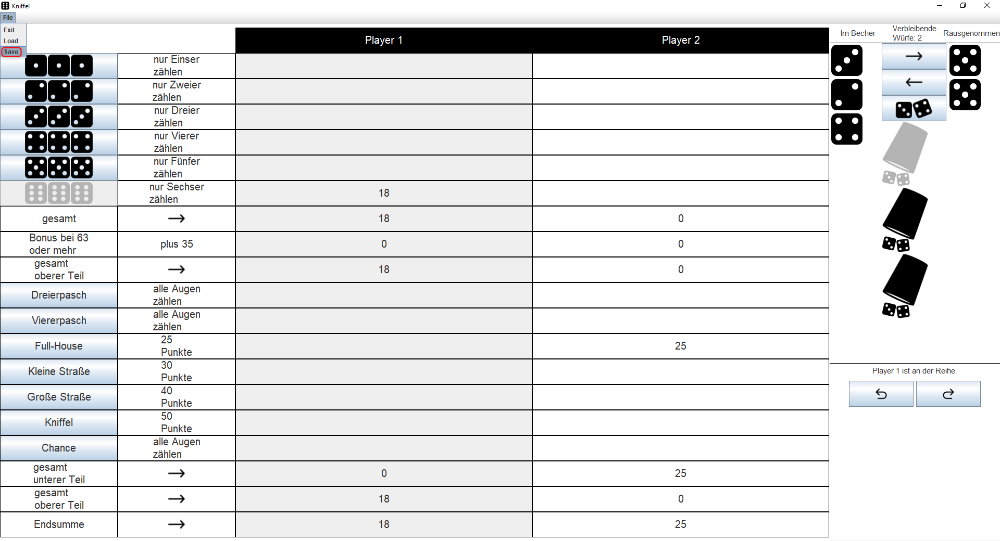
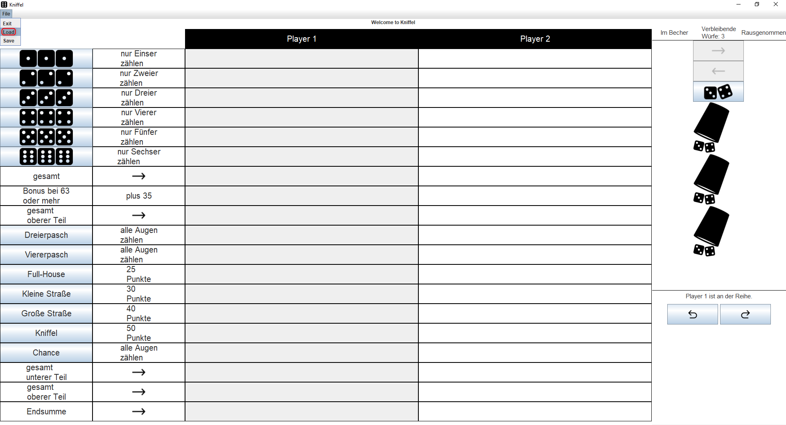

## sbt project compiled with Scala 3

[](https://github.com/leotschritter/kniffel_sarch/actions/workflows/scala.yml)
[](https://coveralls.io/github/leotschritter/kniffel_sarch)
### Usage

This is a normal sbt project. You can compile code with `sbt compile`, run it with `sbt run`, and `sbt console` will start a Scala 3 REPL.

### Test commands

```
sbt clean coverage test
```

```
sbt coverageReport
```

For more information on the sbt-dotty plugin, see the
[scala3-example-project](https://github.com/scala/scala3-example-project/blob/main/README.md).

## Docker Setup
### Requirements

* The Docker container will only run on Windows.
* You need to install a version  of the X Window System Server
    * This one worked for me https://sourceforge.net/projects/xming/
* With Linux start x11-Server with in a separate Terminal window
  ```
  socat TCP-LISTEN:9004,reuseaddr,fork UNIX-CLIENT:\"$DISPLAY\"
  ```
  * ALlow connections to te x11 server from local
  * ```
    xhost +local:
    ```

## Install and run with Docker
### Run with Intellij

You can run the Dockerfile with the Intellij Docker Plugin directly from the IDE.
First you need to select the 'Build Image for 'Dockerfile'' option.
After that you can proceed with 'Run 'Dockerfile''.

### Docker-Compose

* build images with ```./build_docker.sh```
* run ```docker compose up -d```

### Run with Console

Navigate to the project root folder.
```
docker build -t kniffel-image .
```
```
docker run -it --rm -v /tmp/.X11-unix:/tmp/.X11-unix --device /dev/dri -p 8080:8080 --privileged -v :/kniffel kniffel-image
```
# Kniffel
## Game Summary
On each turn, roll the dice up to 3 times to get the highest scoring combination for one of 13 categories. 
After you finish rolling, you must place a score or a zero in one of the 13 category boxes on your score column.
The game ends when all players have filled in their 13 boxes.
Scores are totaled, including any bonus points. The player with the highest total wins.
## Taking a turn
On your turn, you may roll the dice up to 3 times, although you may stop and score after your first or second roll.
To roll the dice, you have to click the dice Button in the GUI or type in 'd' in the TUI.</br></br>
</br>
### Keep dice aside
After each roll you may want to set any "keepers" aside. 
To do so you can select multiple dice on the left-hand side by holding down the Ctrl key while you click the left mouse button.
Another possibility to select multiple dice is to hold down the Shift key and select an area you want to add to the "keepers".
After that you can commit the dice/die you want to keep by clicking the right arrow Button.
</br></br>
</br>
If you're playing in the TUI you can put out your "keepers" by writing down the following command:
```
po 6 6
```
In this example our decision was to put two sixes aside.
### Put dice back into the cup
You may change your mind after any roll. 
At any time you can decide if you want to put dice back into the Cup. 
To do so you can select a single or multiple dice from the right-hand side just like you did before where you put them aside.
If you're playing in the TUI you can re-add the dice just like before but with this command:
```
pi 6 6
```
## Scoring
When you're finished rolling, decide which box to fill in on your score column.
You must fill in a box on each turn; if you can't (or don't want to) enter a score, you must enter a zero.
To enter any score to your column you have to select one option on the left side of the GUI.</br></br>
</br>
If you decide to click the 'Chance'-Button then this Button will be disabled in your next round.</br></br>
</br>
In the TUI you can decide to what you want to do with the following command using the shorthand symbols:
```
wd CH
```
shorthand symbol | 1                  | 2                  | 3                    | 4                   | 5 | 6 | 3X  | 4X  | FH  | KS  | GS | KN | CH
--- |--------------------|--------------------|----------------------|---------------------|---------------------|---------------------|---------------------|---------------------|---------------------|---------------------|---------------------|---------------------| ---
Meaning | Total of Ones only | Total of Twos only | Total of Threes only | Total of Fours only | Total of Fives only | Total of Sixes only | 3 of a Kind | 4 of a Kind | Full House | Small Straight | Large Straight | Kniffel | Chance |

### Scoring Combinations
To score in the Upper Section, only dice with the same number will count.
For example with the dice shown below you should score 9 in the Threes box, 2 in the Twos box or 4 in the Fours box.</br></br>
</br>
Your goal in the Upper Section is to score a total of at least 63 points, to earn a 35-point bonus.
The bonus points are based on scoring of each number;
however, you may earn the bonus with any combination of scores totaling 63 points or more.
Each of the Lower Section scoring combinations is explained in detail in the next second column of the GUI.
#### 3 of a Kind:
Score in this box only if the dice include 3 or more of the same number. 
For example, with the dice shown below you could score 18 points in the 3 of a Kind box.</br></br>
</br>
Other Scoring Options: You could instead score 18 in the Chance box, or you could score in the Upper Section: 15 in the Fives box, 2 in the Twos box or 1 in the Ones box.
#### 4 of a Kind:
Score in this box only if the dice include 4 or more of the same number.
For example, with the dice shown below you could score 14 points in the 4 of a Kind box.</br></br>
</br>
#### Full House:
Score in this box only if the dice show three of one number and two of another. Any Full House is worth 25 points.
For example, with the dice shown below you could score 25 points in the Full House box.</br></br>
</br>
#### Small Straight:
Score in this box only if the dice show any sequence of four numbers. Any Small Straight is worth 30 points.
You could score 30 points in the Small Straight box with any of the three dice combinations shown below.</br></br>
</br>
</br>
</br>
#### Large Straight
Score in this box only if the dice show any sequence of four numbers. Any Large Straight is worth 40 points.
You could score 40 points in the Small Straight box with any of the three dice combinations shown below.</br></br>
</br>
</br>
#### Kniffel
Score in this box only if the dice show five of the same number (5 of a kind).
You can score 50 points in the Kniffel box.
A Kniffel example is shown below.</br></br>
</br>
#### Chance
Score the total of any 5 dice in this box. This catch-all category comes handy when you can't (or don't want to) score in another category, and don't want to enter a zero.
For example, you could score 22 points in the Chance box with the dice shown below.</br></br>
</br>
### Ending a Game
Once each player has filled in all 13 category boxes, the game ends.
### How to Win
After the scores are tallied, the player with the highest 'Endsumme' wins the game!
## Save a game
If you decide to continue playing your game of 'Kniffel' later you are also able to save the current status of the game.
To do so you can select the 'Save' option in the Menu Bar.</br></br>
</br>
To do so in the TUI you can type in the following command.
```
s
```
## Load a game
When you want to load your saved game and continue where you left off you can load the saved game by selecting the 'Load' option in the Menu Bar.</br></br>
</br>
To do so in the TUI you can type in the following command.
```
l
```
